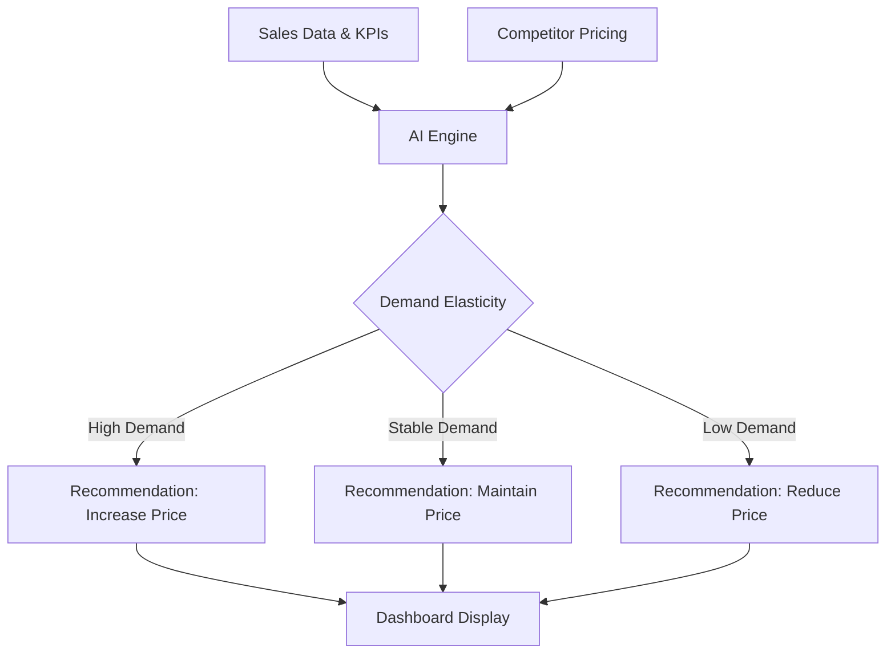
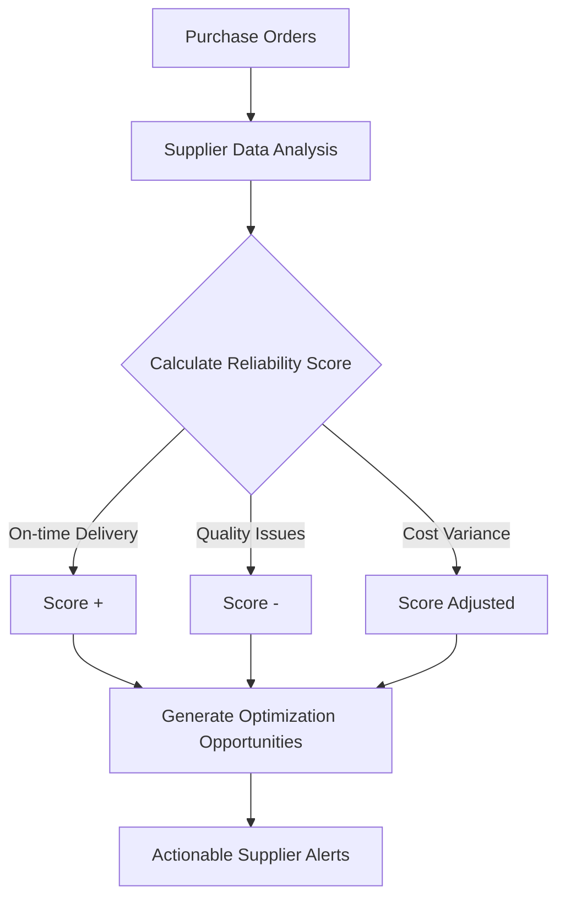
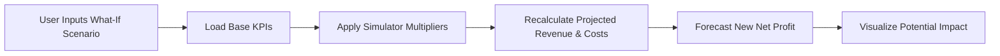

# SME Growth Advisor – AI Business Operating System

An intelligent business operating system powered by Gemma. This application provides real-time cashflow management, pricing intelligence, and supplier advisory to help SMEs optimize their operations, manage finances, and maximize growth.

## Key Features

- **Real-Time Dashboard**: Comprehensive view of your business health, tracking Total Revenue, Net Profit, Cash Flow, and Pending Receivables.
- **AI Advisor (Gemma)**: An integrated AI chat assistant to query business data, gain insights on sales, inventory, customers, and get personalized recommendations.
- **Business Health Score**: Automated health assessment based on profitability, liquidity, operations, and growth metrics.
- **Pricing Advisor (AI)**: Analyzes demand and provides actionable recommendations for price adjustments to maximize profit.
- **Supplier Intelligence**: Monitors supplier performance and identifies savings opportunities through smart recommendations.
- **Growth Simulator**: Interactive "What-If" scenario planning to forecast the impact of business changes on net profit.
- **Inventory & Collections Management**: Automated alerts for low stock items and overdue payments to ensure smooth operations.

## Technology Stack

- **Frontend**: HTML5, CSS3, Vanilla JavaScript, Chart.js for data visualization.
- **Backend**: Python, FastAPI for robust and fast API endpoints.
- **Database**: SQLite, with automatic data initialization from CSV datasets (products, customers, suppliers, sales, etc.).
- **AI Integration**: Custom logic generating Gemma-style reasoning and insights based on real-time business KPIs.

## Project Structure

- `index.html`: Main dashboard and application UI.
- `app.js`: Frontend logic, chart initialization, dynamic DOM updates, and API communication.
- `styles.css`: Custom styling, modern layouts, and responsive design.
- `api.py`: Python FastAPI backend providing data endpoints, KPI computation, and AI insights generation.
- `*.csv`: Sample datasets for initializing the SQLite database.

## Prerequisites

- Python 3.8+
- Modern Web Browser

## Installation & Setup

1. **Clone the repository**:
   ```bash
   git clone https://github.com/uchiha-sasuke-03/AI-Growth-Advisor-Build-with-Gemma-CD.git
   cd AI-Growth-Advisor-Build-with-Gemma-CD
   ```

2. **Install Backend Dependencies**:
   Install the required Python packages:
   ```bash
   pip install fastapi uvicorn pydantic requests
   ```

3. **Run the Backend Server**:
   Start the FastAPI server using `uvicorn`:
   ```bash
   uvicorn api:app --reload --host 0.0.0.0 --port 8000
   ```
   *(Note: The `api.py` file automatically initializes the `sme_data.db` SQLite database from the included CSV files upon starting.)*

4. **Access the Frontend**:
   Simply open the `index.html` file in your preferred web browser, or serve it using a local HTTP server:
   ```bash
   # Run in a separate terminal window
   python -m http.server 5500
   ```
   Then navigate to `http://localhost:5500/index.html` in your browser.

## API Endpoints

The backend provides various endpoints to fetch business data:
- `/api/kpis` & `/api/kpis/summary`: Core business metrics and AI insights.
- `/api/sales`: Sales transactions.
- `/api/products` & `/api/inventory`: Product details and stock levels.
- `/api/customers` & `/api/pending-payments`: Customer profiles and overdue invoices.
- `/api/suppliers` & `/api/purchase-orders`: Procurement and supplier data.
- `/api/chat`: AI chat interface endpoint.

## Architecture & Workflows

### Pricing Advisor (AI) Flow


### Supplier Intelligence Flow


### Growth Simulator Flow

